# aws-ai-practitioner

This is a repo to study for aws ai-practitioner
Udemy: https://www.udemy.com/course/aws-ai-practitioner-certified/

## Section 1 - Artificial Intelligence & Course Introduction

## Section 3 - Introduction to AWS & Cloud Computing

## Section 5 Amazon Bedrock and Gen AI

The forward `diffusion process` is a mathematical framework that gradually transforms data into noise over a series of steps.

### 22. Amazon Bedrock

- Fully manage gen Ai service
- Pay per use
- unified APi
- leverage wide array of foundation models
- 

### 24. Amazon bedrock - Foundation Model
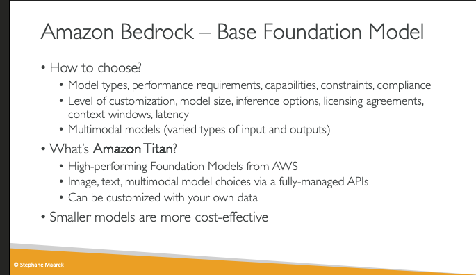
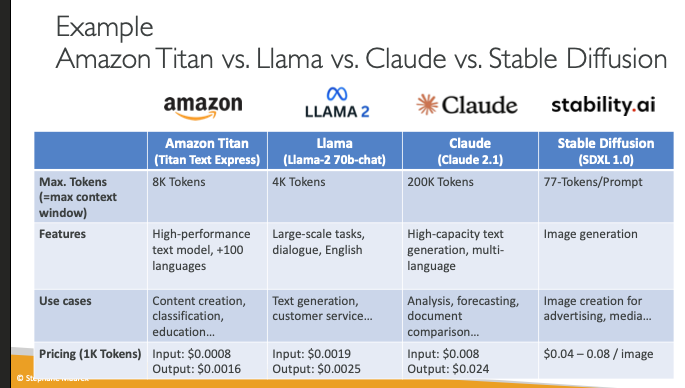

- Amazon Titan - high-performing foundation model from AWS
  - images, text multimodal
  - customize with your own data
- Smaller models are more cost-effective
- 

### 26. Fine-Tuning A model
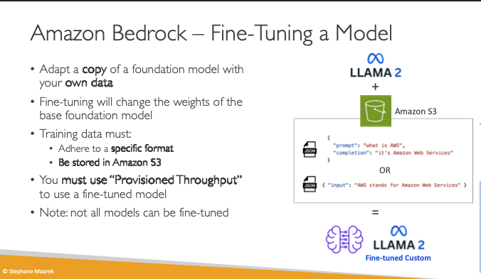
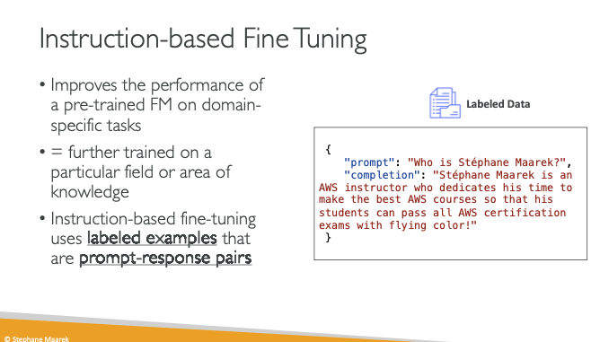

- Fine tuning is when you take a copy of the foundation model and add your own data
- **Must use provisioned throughput**

- `Instruction Based Tuning`
  - improves performance of pre-trained FM on domain specific tasks
  - trained on a specific are of knowledge
  - uses `labeled examples` that are `prompt-response-pairs`
  - 

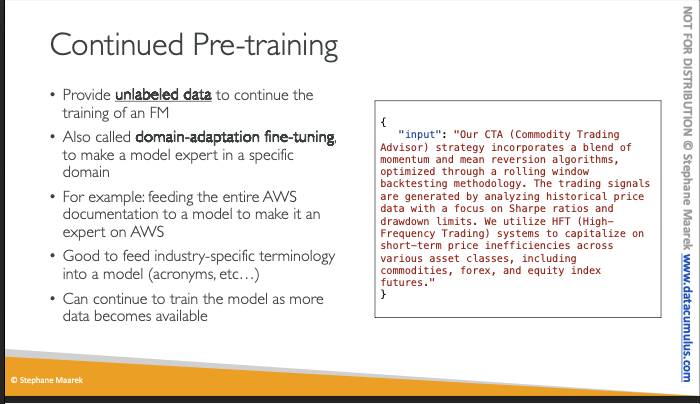

- `Continued Pre-training`
  - provide `unlabaled data` to continue to train a FM
  - AKA `domain-adaptabtion fine tuning` to make a model an expert in a specific domain
    - ex: feed all aws docs into the model
- No prompt output, just input
- Good for industry specific knowledge

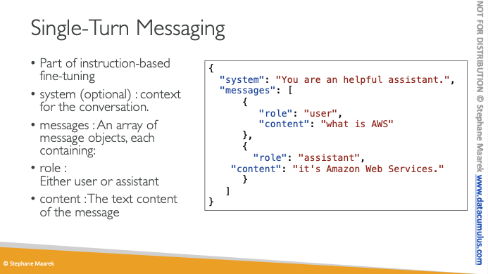
- Part of `isntruction based fine tuning`
  - system - context for the conversation
  - messages - an array of messages objects
    - role - which role is this content for
    - content - the text content of the message
  - Helps training how a chatbot replies to a conversation

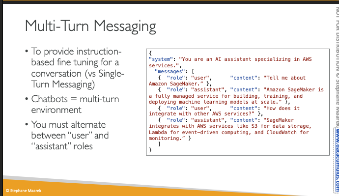
- helps the model understand how to have a conversation with bigger context

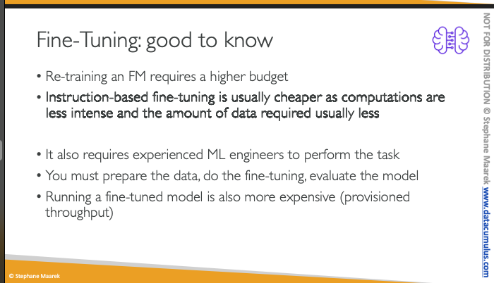
- **retraining requires a higher budget**
  - `instruction based ` is cheaper than `continued pretraining`
    - requires less data
    - continued pretraining may need an experienced engineer

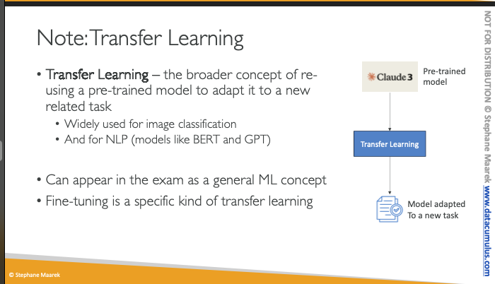
- `Transfer Learning` uses a pre-trained model to adapt it to a new related task
  - widley used for image classification
  - NLP like BERT or GPT
    - can fine tune to a specific task
  - `Fine tuning` is a specific type of `transfer learning`

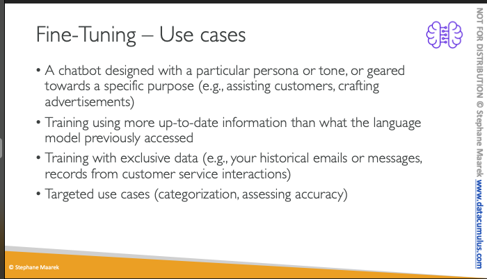
- 

# FM Evaluation
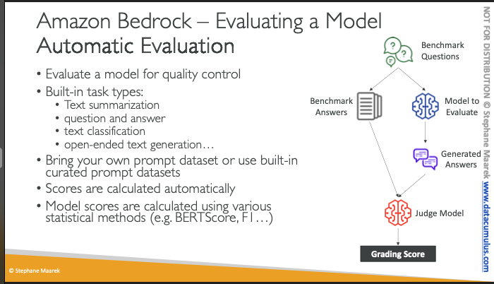
- ` Automtaic evaluation` - uses AI to evaluate the answer of an AI to a question based on the expected benchmark evaluation

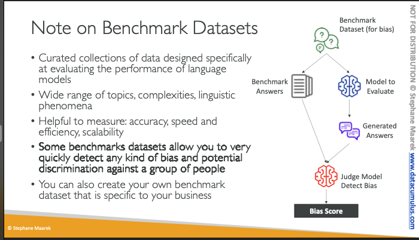
- Some  benchmark dataset allows you to quickly detect a kind of bias against a particular group of people

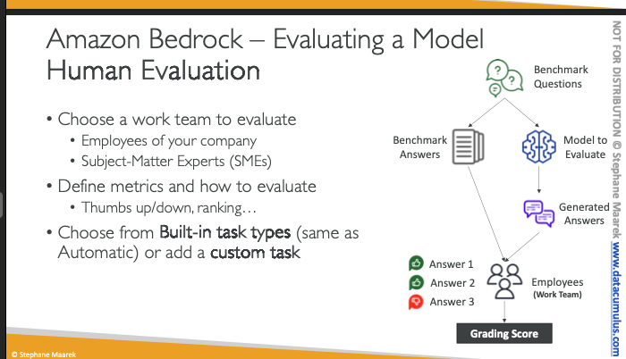
- human looks at benchmark answers vs. generated answers and see if the answer is correct 

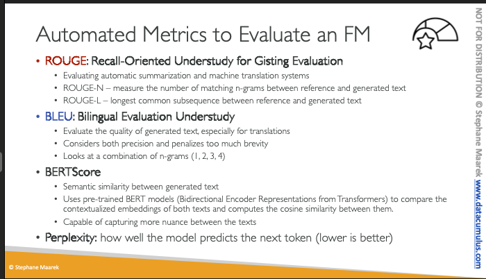
- `ROUGE: Recall-Oriented Understudy for Gusting Evaluation`
  - evaluates automatically summarization and machine translation system
  - `ROUGE-N` - measure the number of matching n-grams between reference and generated text
    - ie: there is a reference text, and there is a generated text, we check how many words (grams) are matching (in the same order) between the answers
  - `ROUGE-L` - measures the longest common subsequence between reference and generated text
- `BLEU` - Bilingual Evaluation Understudy
  - Evaluates the quality of germinated text, especially for translations
  - Consider both precision and brevity
  - Looks at a combination of n-grams
- `BERT SCORE` 
  - Semantic similarity between generated text
  - Compares the meaning of the text
  - USes pre-trained BERT Models (Bidirectional Encoder Representation from Transformers) to compare contextualized embeddings of both texts and computes the cosine similarly between them
  - Capable of capturing more nuance between the texts
- `Perplexity` - how well the model predicts the next token (lower is better )

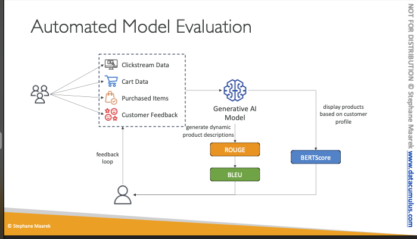
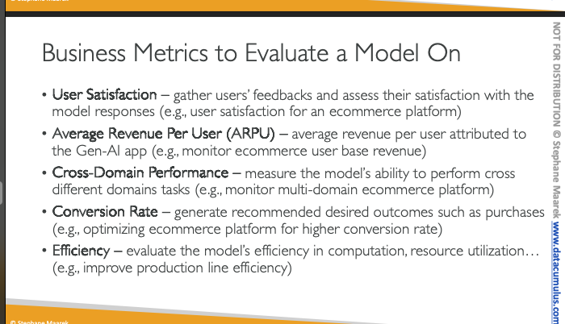
- Can also use these business metrics to evaluate how the model is doing

### 29 RAG & KnowledgeBases
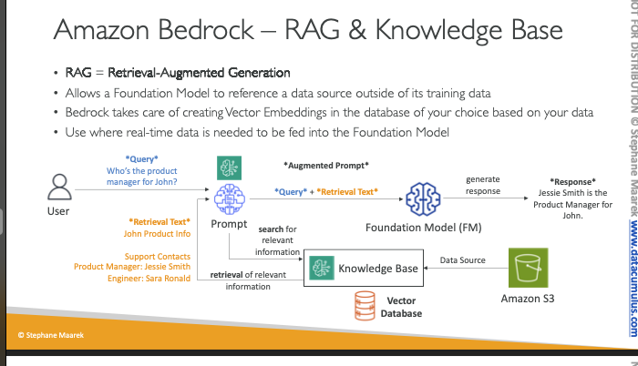
- `Retrieval Augmented Generation`
  - allows a foundation model to reference a data source outside of training data without being fined-tuned
  - can search relevant information in a given knowledge base
    - stored in a  `vector database`
      - creates vector embeddings
  - able to retrieve relevant information form the vector db bases on embedding computations 
  - The original query and text that has been retrieved from the vector will be passed together to the foundation model
    - now the foundation model can use this extra context to answer the question

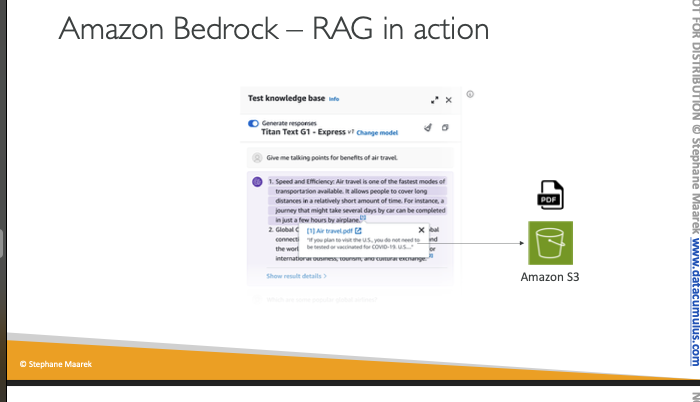
- here there is a link to the air-travel.pdf that came from s3
  - the external context from s3 was used to answer this prompt

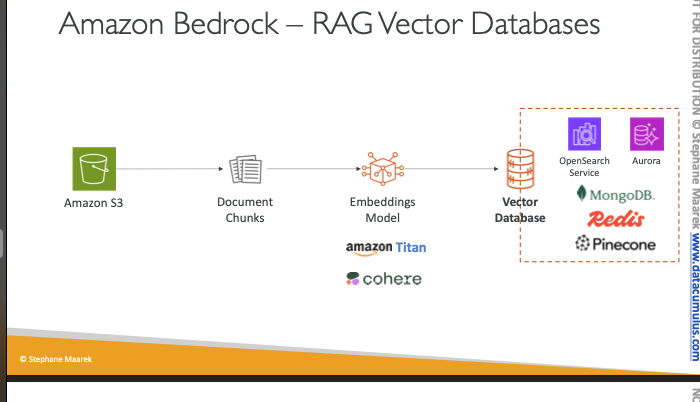
- 2 services on AWS to use a vector db
  - `AWS OpenSearch Service`
    - Default for bedrock
  - `AWS Aurora`
  - Non Aws Services
    - MongoDB (Compatible with `Amazon DocumentDB`)
    - Redis (AWS offers managed service `Amazon Elasticache`)
    - Pinecone
- Must configure an embedding model
  - can be Amazon Titan or Cohere
    - this can be different from your actual model
- Documents are split into chunks, fed into embedding models, which create vectors and which are stored in the db

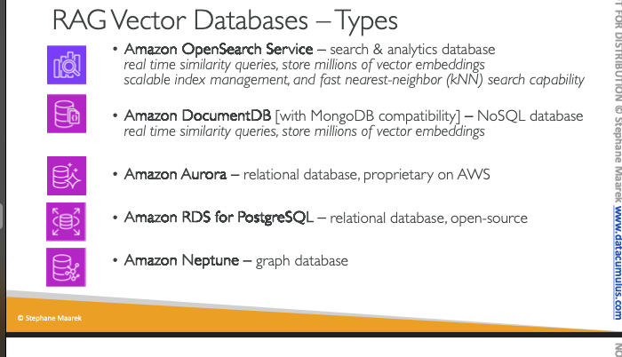
- `Amazon OpenSearch Service` - search analytics database with real time similarity queries,
  - millions of vector embeddings
  - scalable index management
  - fast nearest neighbor (kNN) search capability
- `Amazon DocumentDB`  - NoSQL document database
  - compatible with MongoDB
  - real time similarity queries
  - millions of vector embeddings
- `Amazon Aurora `- relation db, proprietary for AWS
- `Amazon RDS for Postgres` - relational DB - opensource
- `Amazon Neptune` - graph database

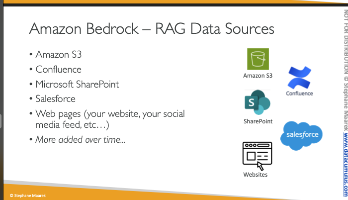
- Can use
  - `Amazon S3`
  - Confluence
  - Web Pages (social media feed)
  - Sharepoint

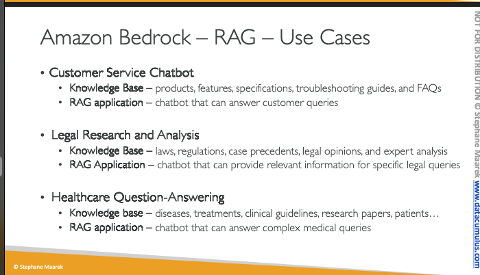
- Customer Service Chatbot
- Legal Ryesearch and Analysis
- Healthcare Question and Answering