# aws-ai-practitioner

This is a repo to study for aws ai-practitioner
Udemy: https://www.udemy.com/course/aws-ai-practitioner-certified/

## Section 1 - Artificial Intelligence & Course Introduction

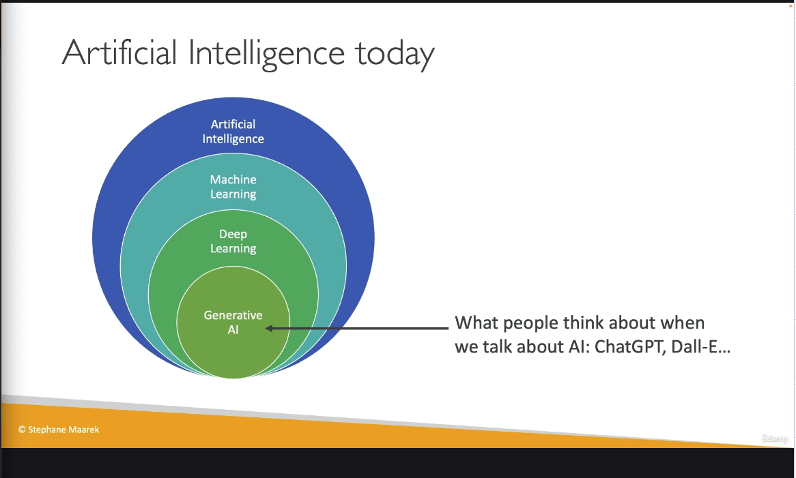

## Section 3 - Introduction to AWS & Cloud Computing

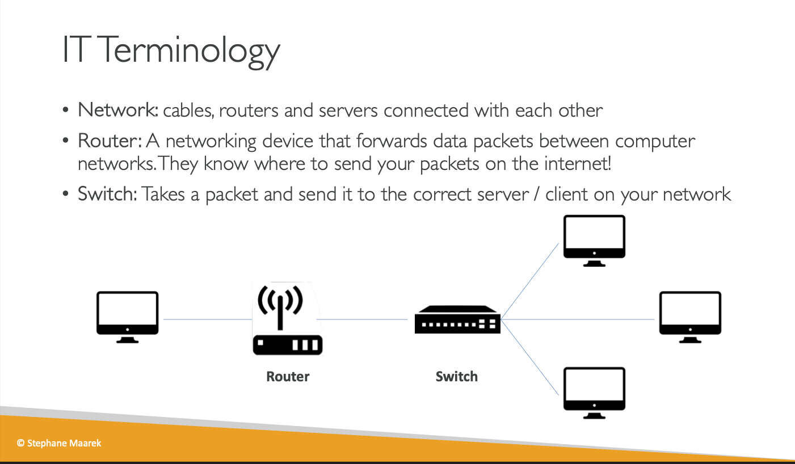
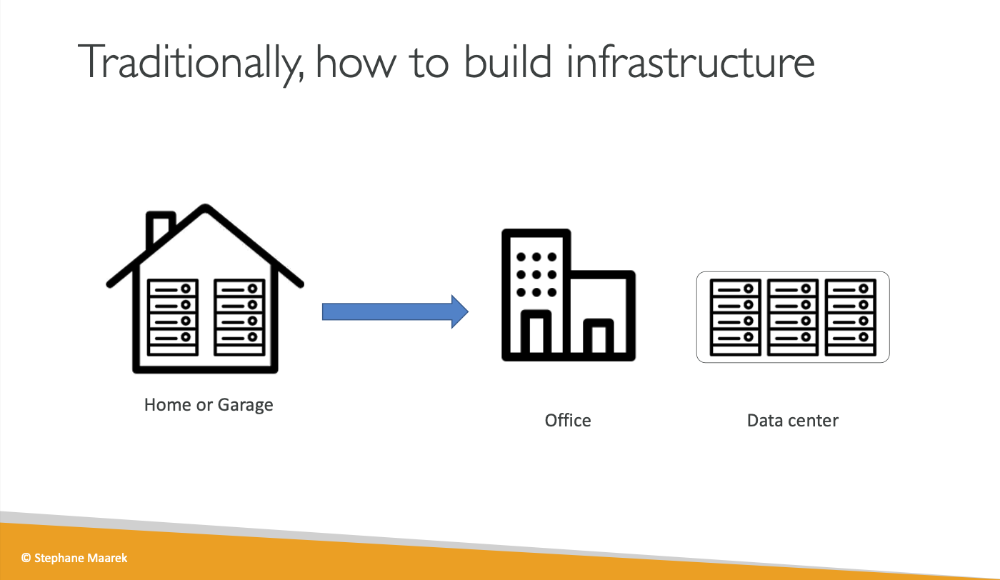
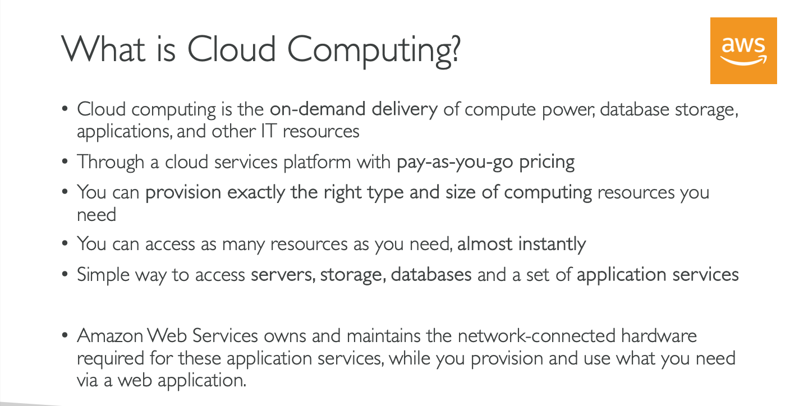
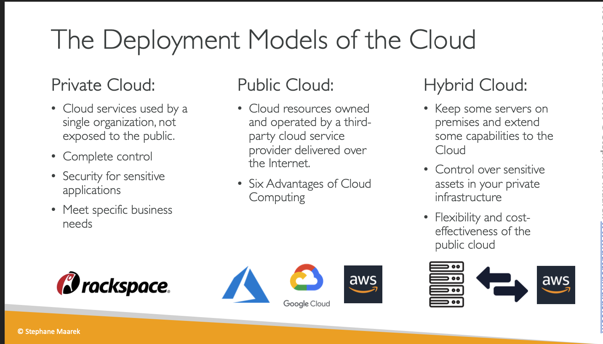

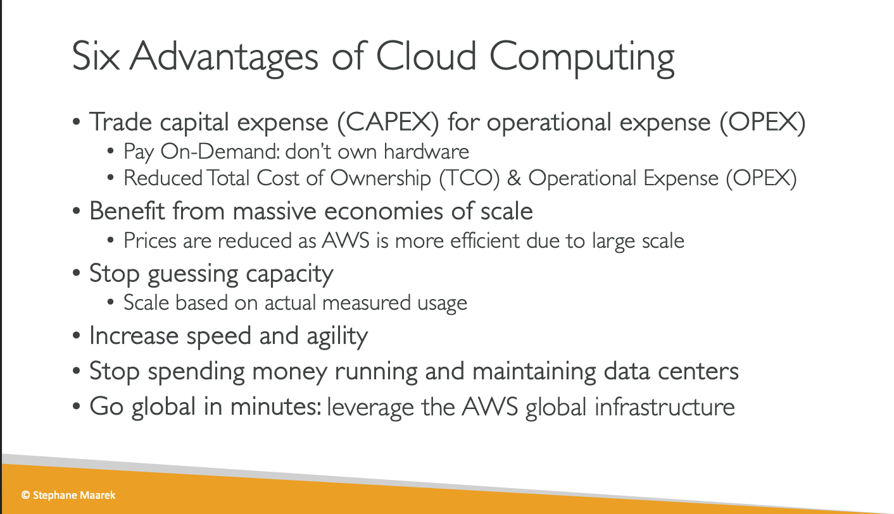
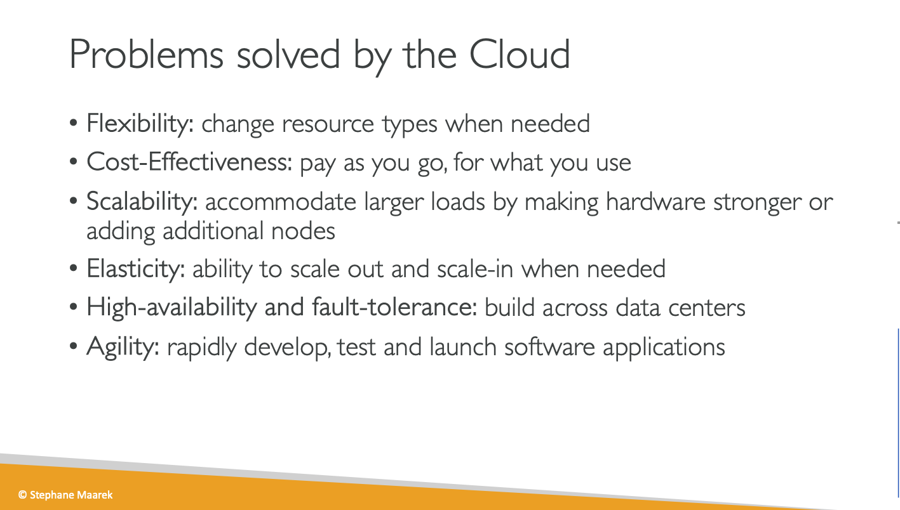
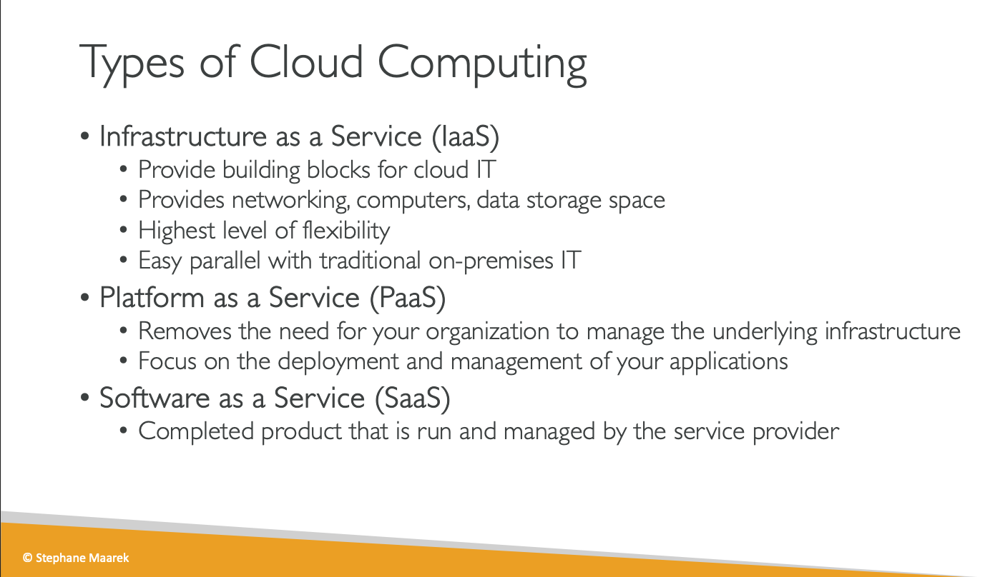

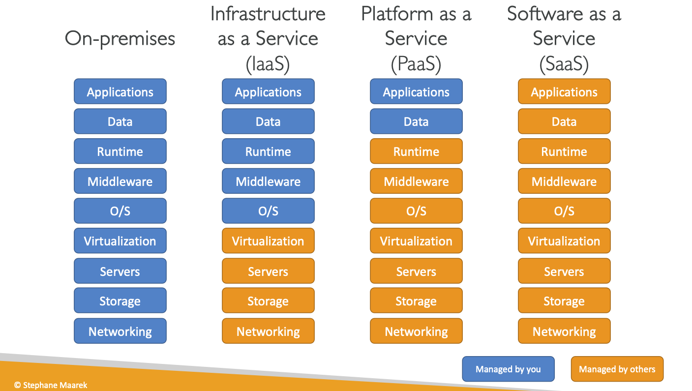
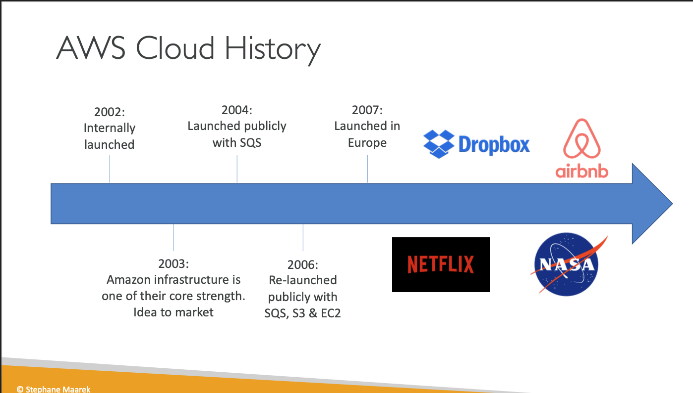
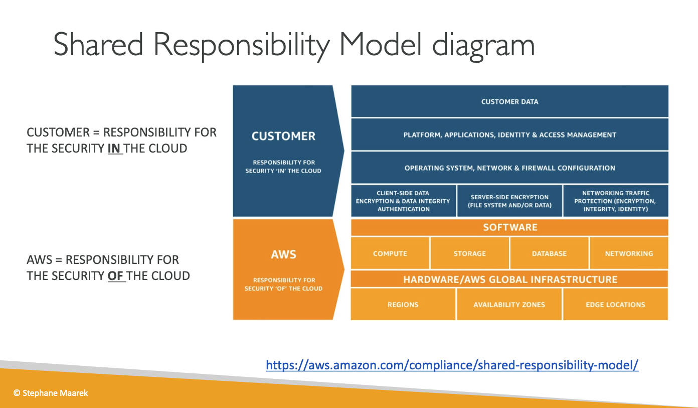

## Section 5 Amazon Bedrock and Gen AI

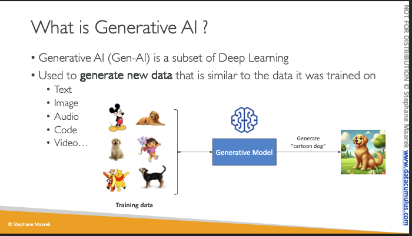
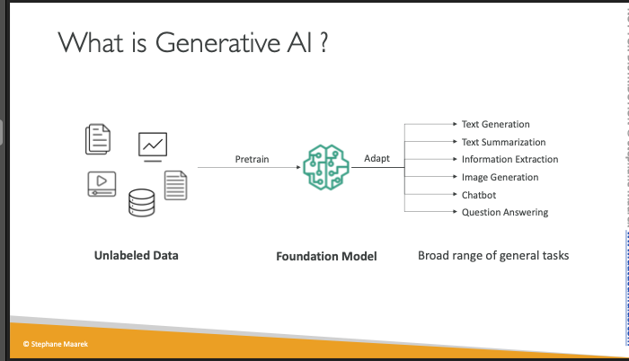
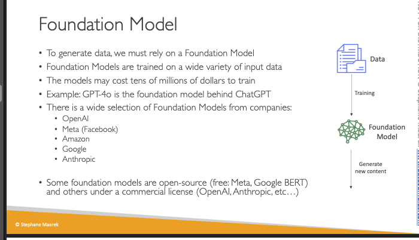
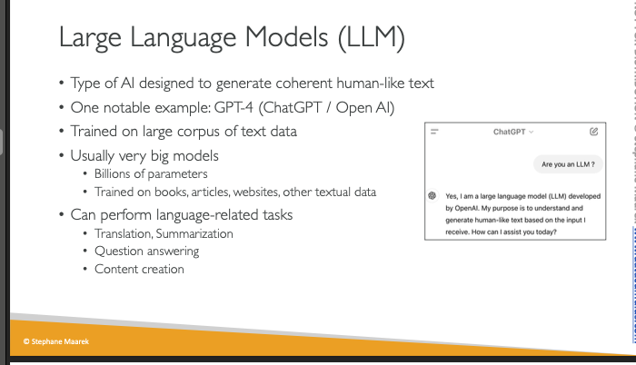
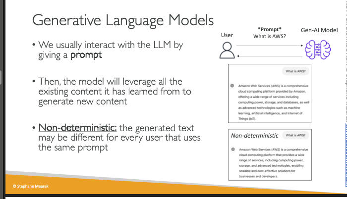
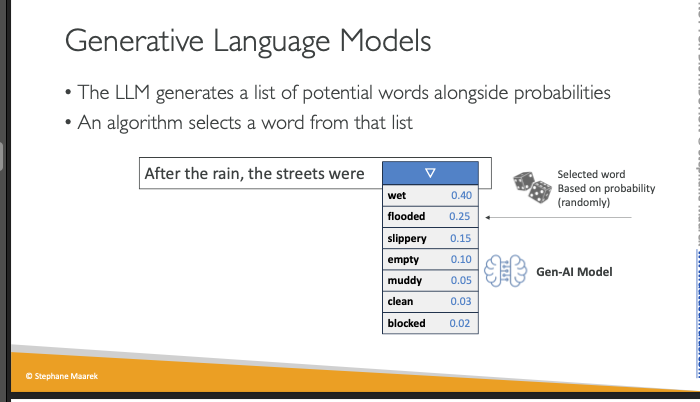
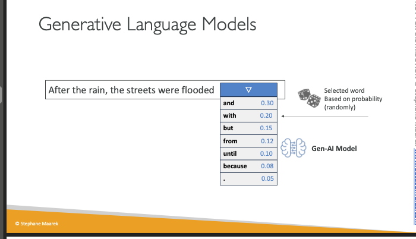
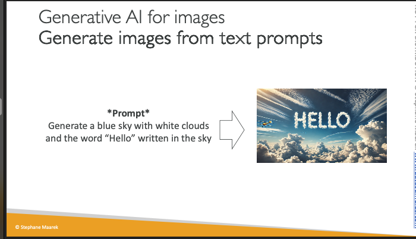

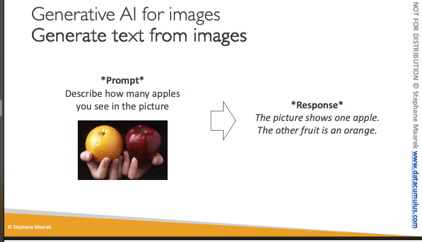
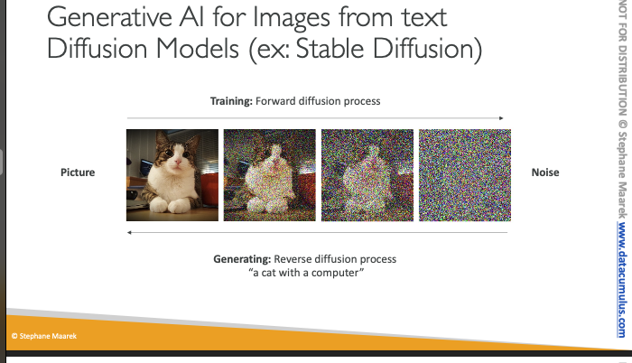

The forward `diffusion process` is a mathematical framework that gradually transforms data into noise over a series of steps.

### 22. Amazon Bedrock
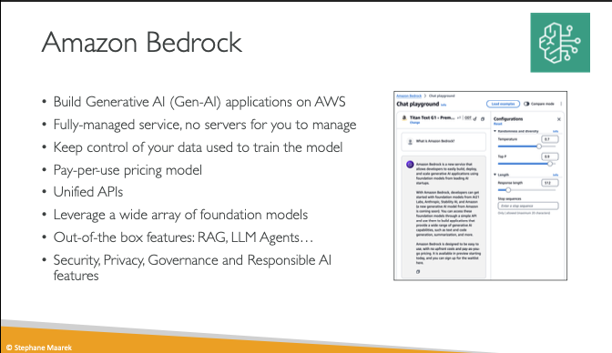
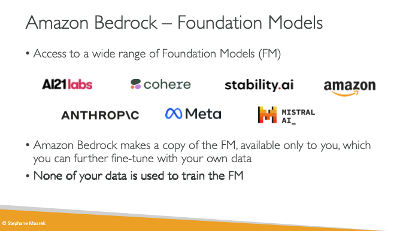
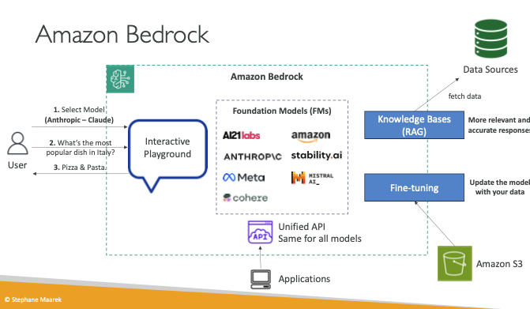

- Fully manage gen Ai service
- Pay per use
- unified APi
- leverage wide array of foundation models
- 

